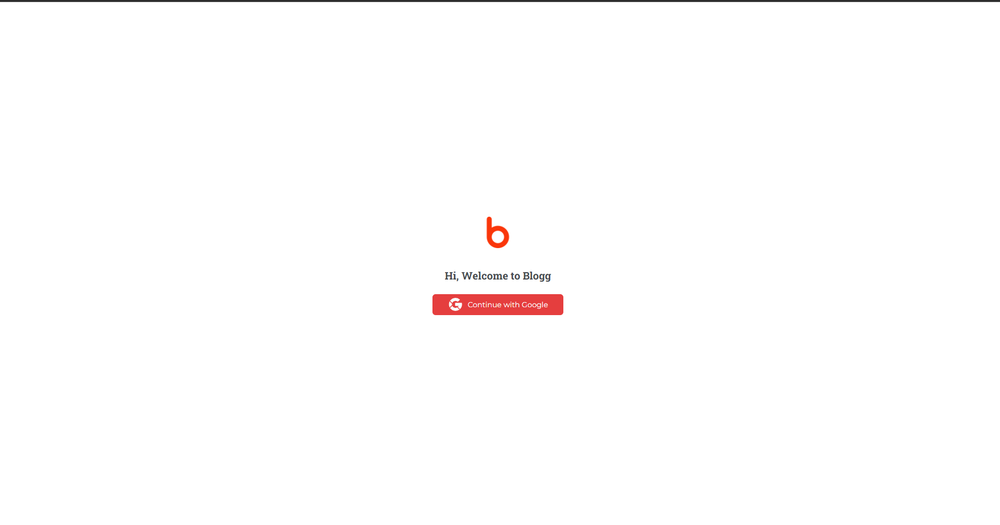
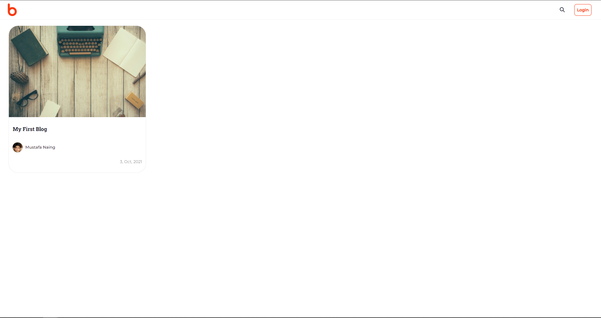
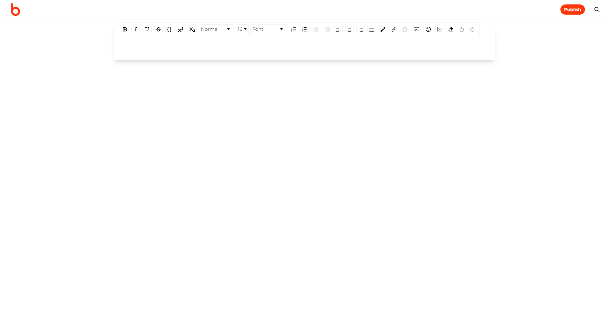

## Blogg

A blog website where users can share their knowledge.

## Project Screen Shots

## Reflection

This is my next js project. I just learned Next js and am trying to build a website using it. So, I decided to build a blog website where users can write articles and share their knowledge.

I use create-next-app for initial setup. I am good with NoSql database (MongoDB) so this time I decided to use Sql database (MySql). I have done a project with MySql back in my university, so I know the basics of MySql. I used Prisma as ORM to query and migrate database. I used Chakra UI for designing UI. I wrote some unit tests with Jest and E2E tests with cypress in this project.
